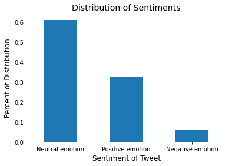
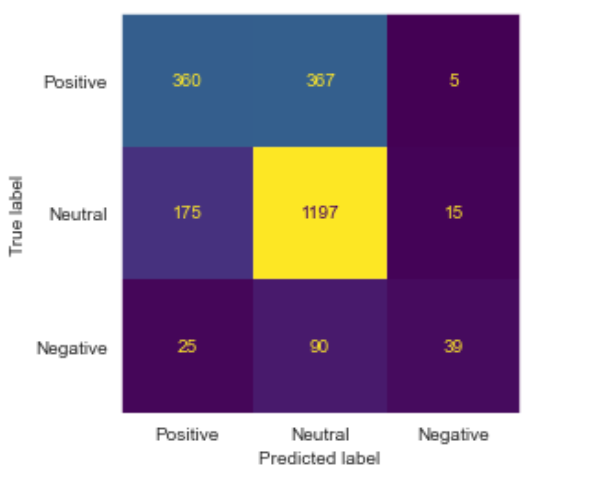

# NLP-Analysis

Data comes from data.world and we are working with about 9091 rows of data. 

Our data are all tweets from twitter during the sxsw that are classified as objects in our dataframe. The tweets are targeted toward an apple or google product, listed along with tweet is the sentiment(positive, negative, neutral) connected to the product or company.

Our target is developing a model that can analyze tweets and determine the sentiment of it. The labels are the sentiments that were rated by humans to be positive, negative, neutral or unknown. We decided to combine the unknown and neutral categories into just neutral. Distribution of the labels are:

Positive: 34%

Neutral: 60%

Negative: 6%

Two major limitations are the imbalance of sentiments and the chaotic structuring of the tweets. 

# Tweet Sentiment Analysis

## Business Problem
We are freelancers showcasing model to determine positive, negative, neutral reaction from tweets. Will help businesses know customers immediate feelings and emotions associated with products. This model will help company be more in touch with customer base, enabling them to address issues quickly and make better marketing decisions.

## Data
We have 9200 tweets from SXSW tech conference where Apple launched the Ipad2, with tweets referencing either Google or Apple. Sentiments of the tweet were decided by a human. [Link to data](https://data.world/crowdflower/brands-and-product-emotions)

## Pre Processing
One NA row was dropped as it had to tweet body. Puncuation was removed and words were tokenized. Snowball stemmer was used to help increase model accuracy. Searched words in the body of the tweet in order to salvage 4886 NA values missing the company label. This helped with our EDA process. Original dataset had four categories but we cut down to three by combining two of them into a neutral catgory. !insert distribution image!

## EDA 

 

This makes the breakdown of our target values 60% neutral, 34% positive, and 6% negative.

 

Chart showing distribution of tweet sentiment by category of item tweeted about. It seems that Apple has more tweets overall, along with more positive tweets.

 

Apps and other products seem to have the highest percentage of positive tweets, perhaps because apps were new and very popular at the time. (This data IS from 2011.)

 

This wordloud shows the words most associated with the positive tweets, showing words like great cool and party. This makes sense that these would be associated with positive tweets.

 

This word clouds shows the words associated with negative tweets. Words like fail, headache battery and long. A common complaint during the festival was the the bad battery life of the iphone!

# Model
Our final model is a TFIDFVectorizer with an SVC classifier. This gave us an accuracy score of 70%

 

Our model needs improvement on finding negative sentiments. Moving forward we would like to find more negative tweets for further model training. More data would help improve the accuracy.

For all model iterations please refer to the final notebook.

# Conclusion
An NLP model can help a company:
- Determine sentiment of product quickly after release  
- Identify problems not directly reported to company  
- Provide quicker feedback  than relying on actual reviews  
- Can be used to make improvements on events that happen annually  

